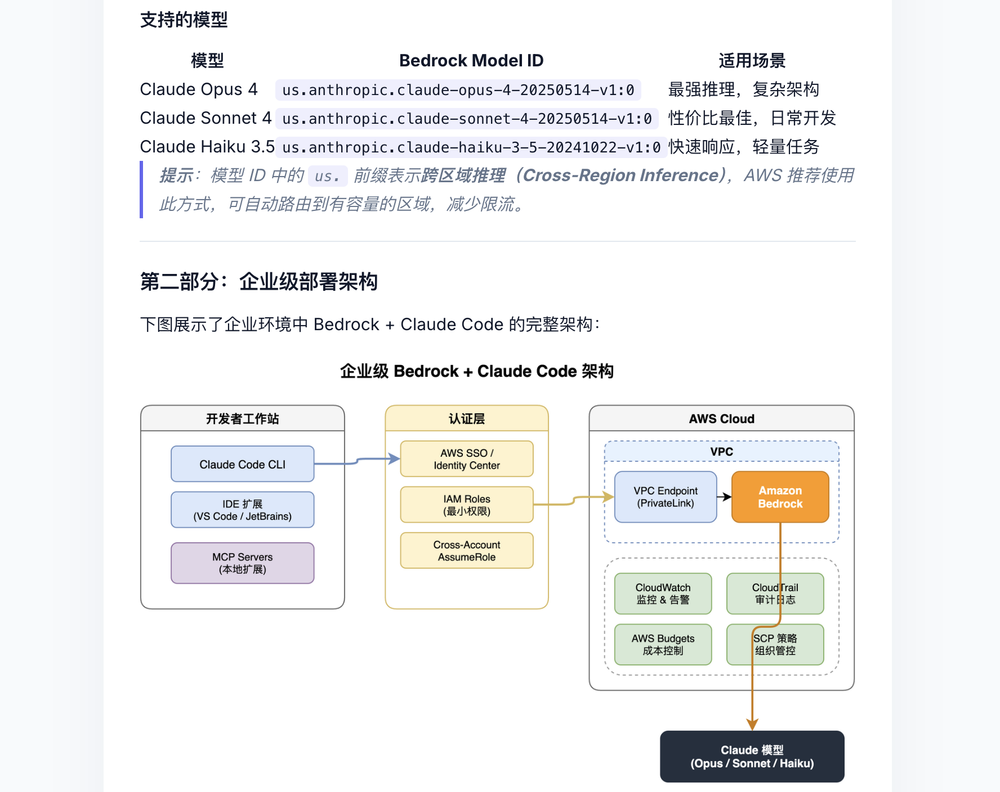

# KBB - 知识库构建器 (Knowledge Base Builder)

一个 Claude Code MCP 服务器，一句话就能把任何主题变成带图表的知识库文章。

An MCP server for Claude Code that turns any topic into an illustrated knowledge base article with a single command.

## 功能特性 / Features

- **智能研究** — Claude 先基于自身知识生成专业研究资料，再搜索网络补充最新信息
- **文件采集** — 支持 PDF、DOCX、PPTX、XLSX、HTML、图片、音频等格式，使用 [MarkItDown](https://github.com/microsoft/markitdown) 转换为 Markdown
- **内容整理** — Claude 阅读所有资料，提取精华，组织成结构化知识文章
- **知识可视化** — 集成 [Draw.io](https://github.com/jgraph/drawio-mcp) 生成流程图、对比矩阵等，导出高清 PNG 嵌入文章
- **一键发布** — 通过 [FlowMind](https://flowmind.life) API 发布带图文的知识文章，支持公开分享链接

本工具生成的文章排版优美、图文并茂，容易理解。
- [示例1: 40岁男性如何科学增肌](https://flowmind.life/share/note/e5fef824-6551-4e6d-b46d-816c163928bd)
- [示例2:通过 AWS Bedrock 使用 Claude Code](https://flowmind.life/share/note/beb348f8-3479-4601-9878-05f5b4496268)



## 工作流程 / How It Works

```
/kbb 45岁男人如何有效护肤 --auto-share

Step 1  Claude 知识库    基于训练知识生成 2-4 篇深度研究文件
Step 2  网络搜索补充     DuckDuckGo 搜索 + 抓取相关文章
Step 3  文件转换         MarkItDown 统一转换为 Markdown
Step 4  内容整理         Claude 阅读全部资料，组织成结构化文章
Step 5  图表生成         Draw.io 创建流程图/对比图 → 导出 PNG
Step 6  发布             FlowMind 发布文章 + 上传图片 → 公开分享链接
```

## 支持平台 / Supported Platforms

- macOS
- Linux
- Windows (通过 WSL)

## 前置要求 / Prerequisites

- [Node.js](https://nodejs.org/) >= 18
- [Python](https://www.python.org/) >= 3.10
- [Claude Code](https://claude.ai/download) CLI
- [Flowmind账号](https://flowmind.life)  

## 快速开始 / Quick Start

```bash
git clone https://github.com/haohappy/kbb.git
cd kbb
./setup.sh
```

`setup.sh` 会自动完成以下步骤：
1. 检查 Node.js 和 Python 版本
2. 创建 Python 虚拟环境并安装 MarkItDown
3. 安装 Node.js 依赖并编译
4. 注册 KBB 为 Claude Code MCP 服务器
5. 安装 `/kbb` 技能（slash command）
6. （可选）注册 Draw.io MCP
7. （可选）配置 FlowMind API

安装完成后，重启 Claude Code，输入：

```
/kbb 你感兴趣的研究主题
```

## 使用方式 / Usage

### 帮助
```
/kbb help      # 查看帮助
```

### 三种模式

```
# 研究模式（零准备，只需一个主题）
/kbb 睡眠质量改善                          # Claude知识 + 网络搜索 → 整理 → 画图 → 发布
/kbb 间歇性断食的科学依据 --auto-share      # 同上 + 生成公开分享链接

# 单文件模式（读取一个文档，总结并发布）
/kbb docs/report.md --auto-share           # 读取 → 总结 → 插图 → 发布
/kbb ~/Downloads/paper.pdf                 # 支持 PDF、DOCX、PPTX 等格式

# 目录模式（处理一个目录中的所有文件）
/kbb ~/research/sleep 睡眠质量改善          # 使用已有文件
/kbb ~/papers/ai-safety AI Safety --no-pub  # 只生成文章，不发布
```

### 配置Flowmind
1. 访问https://flowmind.life
2. 注册账号
3. 登录->Settings->API Keys->Create Key

```
/kbb config-flowmind                       # 查看 FlowMind 配置状态
/kbb config-flowmind <api-key>             # 设置 FlowMind API Key，填入上面Create Key获得的API Key  
/kbb help                                  # 显示帮助
```

### 指定图表类型

```
/kbb diagram list                                     # 列出所有可用图表类型
/kbb 睡眠质量改善 --diagram=mindmap,flowchart           # 指定生成思维导图和流程图
/kbb docs/report.md --diagram=architecture --auto-share # 单文件 + 指定架构图
```

不指定 `--diagram` 时，Claude 会根据内容自动选择最合适的图表类型。

支持的 12 种图表类型：

| 类型 | 名称 | 适合场景 |
|------|------|---------|
| `flowchart` | 流程图 | 决策路径、操作步骤、排错指南 |
| `mindmap` | 思维导图 | 主题概览、知识分支、头脑风暴 |
| `matrix` | 二维矩阵 | 对比分析（风险vs收益、证据vs安全性） |
| `architecture` | 架构图 | 系统设计、技术栈、基础设施 |
| `timeline` | 时间线 | 历史事件、项目阶段、路线图 |
| `comparison` | 对比表 | 产品对比、方案优缺点 |
| `pyramid` | 金字塔 | 优先级排名、证据层级 |
| `venn` | 韦恩图 | 概念异同、集合关系 |
| `sequence` | 序列图 | API调用、用户流程、交互时序 |
| `orgchart` | 组织图 | 层级结构、分类体系 |
| `swimlane` | 泳道图 | 跨团队/跨角色流程 |
| `cycle` | 循环图 | 迭代流程、反馈循环 |

### 参数说明

| 参数 | 说明 |
|------|------|
| `<topic>` | 研究主题（研究模式） |
| `<file>` | 单个文件路径（单文件模式，支持 .md/.txt/.pdf/.docx 等） |
| `<directory> <topic>` | 资料目录 + 主题（目录模式） |
| `--diagram=type1,type2` | 指定图表类型（逗号分隔），不指定则自动选择 |
| `--auto-share` | 发布到 FlowMind + 生成公开链接（任何人无需登录即可查看） |
| `--no-pub` | 不发布到 FlowMind，只在本地生成文章 |
| （无参数） | 默认发布到 FlowMind（私有，需登录查看） |

> **没有 FlowMind 账号？** 没关系。如果未配置 FlowMind API Key，KBB 会自动切换到 `--no-pub` 模式，文章在本地生成，不会报错。你可以随时通过 `/kbb config-flowmind` 配置 API Key 来启用发布功能。

## MCP 工具 / Tools

| 工具 | 说明 |
|------|------|
| `kbb_config` | 配置 FlowMind API Key（`/kbb config-flowmind`） |
| `kbb_research` | 搜索网络，抓取文章，保存为本地文件 |
| `kbb_ingest` | 将目录中的文件转换为 Markdown（使用 MarkItDown） |
| `kbb_extract` | 读取目录中所有 Markdown 文件的内容 |
| `kbb_export_diagram` | 将 draw.io XML 导出为高清 PNG 图片 |
| `kbb_publish` | 发布文章到 FlowMind，支持 `{{IMG:id}}` 占位符和 `auto_share` |
| `kbb_upload_image` | 上传图片到 FlowMind 笔记，替换占位符 |
| `kbb_list` | 列出已发布的知识文章 |
| `kbb_pipeline` | 完整流水线：采集 → 提取 → 返回给 Claude 整理 |

## 图文发布流程 / Image Publishing

KBB 支持在文章中嵌入高清图表：

```
1. mcp__drawio__create_diagram(xml)     → 预览图表
2. kbb_export_diagram(xml, filename)     → 导出为 PNG
3. kbb_publish(title, content)           → 发布文章，内容中用 {{IMG:id}} 标记图片位置
4. kbb_upload_image(note_id, png, id)    → 上传 PNG，FlowMind 自动替换占位符
```

**前置要求**：图表导出需要安装 [draw.io desktop](https://github.com/jgraph/drawio-desktop/releases)（提供 `drawio` CLI 命令）。

## 研究模式详解 / Research Mode

当只提供主题不提供目录时，KBB 自动进入研究模式，分两个阶段收集资料：

### Phase A: Claude 知识库

Claude 基于自身训练知识生成 2-4 个深度研究文件，覆盖主题的不同维度。这些文件：
- 包含具体数据、研究引用、机制解释和实用建议
- 按子主题组织（如护肤主题会分为"皮肤衰老科学"、"循证成分"、"日常流程"等）
- 以 `00_claude_` 前缀命名，确保排在网络来源之前

### Phase B: 网络搜索

通过 DuckDuckGo 搜索并抓取相关网页，补充：
- 最新产品推荐和价格信息
- 地区特定的内容
- 真实用户经验
- Claude 训练截止日期之后的数据

两个来源的优势互补：**Claude 提供深度和准确性，网络提供时效性和多样性**。

## 手动安装 / Manual Installation

如果不想使用自动安装脚本：

```bash
# 1. 克隆并构建
git clone https://github.com/haohappy/kbb.git
cd kbb
npm install
npm run build

# 2. 创建 Python 虚拟环境并安装 MarkItDown
python3 -m venv .venv
.venv/bin/pip install markitdown==0.1.5

# 3. 注册 KBB MCP 服务器
claude mcp add kbb -- node "$(pwd)/dist/index.js"

# 4. 安装 /kbb 技能
mkdir -p ~/.claude/skills/kbb
cp skill/SKILL.md ~/.claude/skills/kbb/SKILL.md

# 5. （可选）注册 Draw.io MCP
claude mcp add drawio --transport sse https://mcp.draw.io/mcp

# 6. （可选）配置 FlowMind
mkdir -p ~/.flowmind && chmod 700 ~/.flowmind
cat > ~/.flowmind/config.json << 'EOF'
{"api_key": "your_api_key_here", "base_url": "https://flowmind.life/api/v1"}
EOF
chmod 600 ~/.flowmind/config.json
```

## 配置 / Configuration

### FlowMind（可选）

FlowMind 配置存储在 `~/.flowmind/config.json`：

```json
{
  "api_key": "your_api_key_here",
  "base_url": "https://flowmind.life/api/v1"
}
```

获取 API Key：访问 [FlowMind](https://flowmind.life) 注册账号。

也可以安装 FlowMind 的 Claude Code 技能：[cc-skill-flowmind](https://github.com/haohappy/cc-skill-flowmind)

### Draw.io MCP（可选）

Draw.io MCP 用于在终端预览图表。注册方式：

```bash
claude mcp add drawio --transport sse https://mcp.draw.io/mcp
```

详情见：[drawio-mcp](https://github.com/jgraph/drawio-mcp)

图表导出为 PNG 需要安装 [draw.io desktop](https://github.com/jgraph/drawio-desktop/releases)。

### 自动允许工具执行

KBB 项目自带 `.claude/settings.json`，在本项目目录内运行时所有 kbb 工具会自动执行，无需每次确认。

如果你在**其他项目目录**中使用 `/kbb`，可以在该项目创建 `.claude/settings.json`：

```json
{
  "permissions": {
    "allow": [
      "mcp__kbb__kbb_config",
      "mcp__kbb__kbb_research",
      "mcp__kbb__kbb_ingest",
      "mcp__kbb__kbb_extract",
      "mcp__kbb__kbb_pipeline",
      "mcp__kbb__kbb_export_diagram",
      "mcp__kbb__kbb_publish",
      "mcp__kbb__kbb_upload_image",
      "mcp__kbb__kbb_list",
      "mcp__drawio__create_diagram"
    ]
  }
}
```

或者在 Claude Code 运行时选择 "Yes, and don't ask again" 逐个授权。

### Python 路径

KBB 默认使用项目目录下的 `.venv/bin/python`。如果需要指定其他 Python 路径：

```bash
export MARKITDOWN_PYTHON=/path/to/python3
```

## 示例 / Examples

项目包含两个示例目录，可直接体验：

```bash
# 睡眠质量改善（4个研究文件）
/kbb ./examples/sleep-quality 睡眠质量改善

# 40岁男性增肌（4个研究文件）
/kbb ./examples/muscle-building-40 40岁男性如何科学增肌
```

## 常见问题 / FAQ

**Q: 移动了项目目录后工具不可用了？**
A: 重新运行 `./setup.sh`，MCP 注册使用绝对路径，移动目录后需要重新注册。

**Q: kbb_publish 报错"FlowMind 未配置"？**
A: FlowMind 是可选功能。运行 `./setup.sh` 配置，或手动创建 `~/.flowmind/config.json`。

**Q: MarkItDown 转换失败？**
A: 确认 `.venv` 目录存在且 markitdown 已安装。可重新运行 `./setup.sh`。

**Q: 研究模式搜索不到结果？**
A: DuckDuckGo 搜索不需要 API key，但某些网站可能阻止抓取。Claude 的知识库内容仍会生成，网络搜索只是补充。

**Q: 图表没有嵌入文章？**
A: 需要安装 [draw.io desktop](https://github.com/jgraph/drawio-desktop/releases) 以提供 `drawio` CLI。未安装时文章正常发布但不含图表。

**Q: Windows 支持？**
A: 建议使用 WSL (Windows Subsystem for Linux)。

## License

MIT
