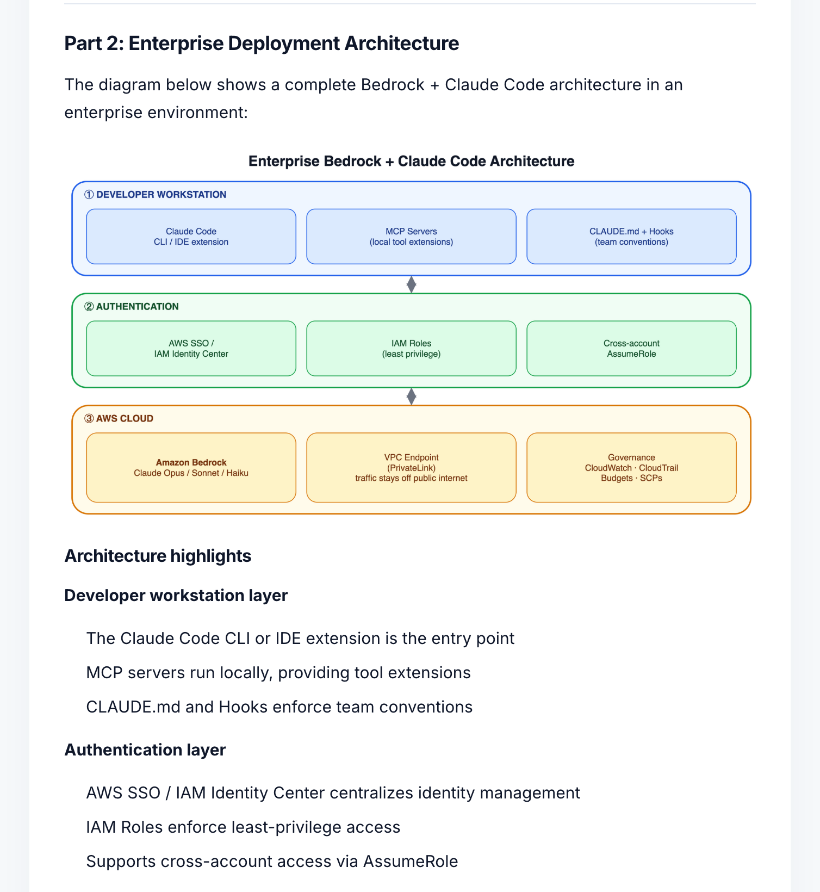

# KBB - Knowledge Base Builder

**English** | [中文](README.zh-CN.md)

A Claude Code MCP server that turns any topic into an illustrated knowledge base article with a single command.

## Features

- **Smart research** — Claude first generates expert research material from its own knowledge, then searches the web to supplement it with the latest information
- **File ingestion** — Supports PDF, DOCX, PPTX, XLSX, HTML, images, audio, and more, converting them to Markdown via [MarkItDown](https://github.com/microsoft/markitdown)
- **Content organization** — Claude reads all the material, extracts the essentials, and organizes it into a structured knowledge article
- **Knowledge visualization** — Integrates [Draw.io](https://github.com/jgraph/drawio-mcp) to generate flowcharts, comparison matrices, and more, exported as high-resolution PNGs embedded in the article
- **One-click publishing** — Publishes illustrated knowledge articles via the [FlowMind](https://flowmind.life) API, with support for public share links

Articles generated by this tool are beautifully typeset, richly illustrated, and easy to understand.
- [Example 1: Improving Sleep Quality](https://flowmind.life/share/note/ac09a518-ae04-49b8-a402-09a5ee77b7d0)
- [Example 2: How a 40-Year-Old Man Can Build Muscle Scientifically](https://flowmind.life/share/note/e5fef824-6551-4e6d-b46d-816c163928bd)
- [Example 3: Using Claude Code via AWS Bedrock](https://flowmind.life/share/note/beb348f8-3479-4601-9878-05f5b4496268)



## How It Works

```
/kbb How a 45-year-old man can care for his skin effectively --auto-share

Step 1  Claude knowledge    Generate 2-4 in-depth research files from training knowledge
Step 2  Web search          DuckDuckGo search + fetch relevant articles
Step 3  File conversion     MarkItDown converts everything to Markdown
Step 4  Organization        Claude reads all material, organizes into a structured article
Step 5  Diagram generation  Draw.io creates flowcharts/comparisons → export PNG
Step 6  Publish             FlowMind publishes article + uploads images → public share link
```

## Supported Platforms

- macOS
- Linux
- Windows (via WSL)

## Prerequisites

- [Node.js](https://nodejs.org/) >= 18
- [Python](https://www.python.org/) >= 3.10
- [Claude Code](https://claude.ai/download) CLI
- [FlowMind account](https://flowmind.life)

## Quick Start

```bash
git clone https://github.com/haohappy/kbb.git
cd kbb
./setup.sh
```

`setup.sh` automatically completes the following steps:
1. Checks Node.js and Python versions
2. Creates a Python virtual environment and installs MarkItDown
3. Installs Node.js dependencies and compiles
4. Registers KBB as a Claude Code MCP server
5. Installs the `/kbb` skill (slash command)
6. (Optional) Registers the Draw.io MCP
7. (Optional) Configures the FlowMind API

Once installation is complete, restart Claude Code and enter:

```
/kbb <a research topic you're interested in>
```

## Usage

### Help
```
/kbb help      # Show help
```

### Three Modes

```
# Research mode (zero prep, just a topic)
/kbb Improving sleep quality                        # Claude knowledge + web search → organize → diagram → publish
/kbb The science of intermittent fasting --auto-share  # Same as above + generate a public share link

# Single-file mode (read one document, summarize and publish)
/kbb docs/report.md --auto-share                    # Read → summarize → illustrate → publish
/kbb ~/Downloads/paper.pdf                          # Supports PDF, DOCX, PPTX, and more

# Directory mode (process all files in a folder)
/kbb ~/research/sleep Improving sleep quality       # Use existing files
/kbb ~/papers/ai-safety AI Safety --no-pub          # Generate the article only, don't publish
```

### Configuring FlowMind
1. Visit https://flowmind.life
2. Create an account
3. Log in → Settings → API Keys → Create Key

```
/kbb config-flowmind                       # Check FlowMind configuration status
/kbb config-flowmind <api-key>             # Set the FlowMind API Key using the key created above
/kbb help                                  # Show help
```

### Specifying Diagram Types

```
/kbb diagram list                                     # List all available diagram types
/kbb Improving sleep quality --diagram=mindmap,flowchart   # Generate a mind map and a flowchart
/kbb docs/report.md --diagram=architecture --auto-share    # Single file + specify an architecture diagram
```

When `--diagram` is not specified, Claude automatically chooses the most suitable diagram type based on the content.

The 12 supported diagram types:

| Type | Name | Best For |
|------|------|---------|
| `flowchart` | Flowchart | Decision paths, operational steps, troubleshooting guides |
| `mindmap` | Mind map | Topic overviews, knowledge branches, brainstorming |
| `matrix` | 2D matrix | Comparative analysis (risk vs. reward, evidence vs. safety) |
| `architecture` | Architecture diagram | System design, tech stacks, infrastructure |
| `timeline` | Timeline | Historical events, project phases, roadmaps |
| `comparison` | Comparison table | Product comparisons, pros and cons of options |
| `pyramid` | Pyramid | Priority rankings, evidence hierarchies |
| `venn` | Venn diagram | Conceptual similarities/differences, set relationships |
| `sequence` | Sequence diagram | API calls, user flows, interaction timing |
| `orgchart` | Org chart | Hierarchical structures, classification systems |
| `swimlane` | Swimlane diagram | Cross-team/cross-role processes |
| `cycle` | Cycle diagram | Iterative processes, feedback loops |

### Parameters

| Parameter | Description |
|------|------|
| `<topic>` | Research topic (research mode) |
| `<file>` | Path to a single file (single-file mode, supports .md/.txt/.pdf/.docx, etc.) |
| `<directory> <topic>` | Source directory + topic (directory mode) |
| `--diagram=type1,type2` | Specify diagram types (comma-separated); auto-selected if omitted |
| `--auto-share` | Publish to FlowMind + generate a public link (viewable by anyone, no login required) |
| `--no-pub` | Don't publish to FlowMind, generate the article locally only |
| (no parameters) | Publish to FlowMind by default (private, requires login to view) |

> **No FlowMind account?** No problem. If the FlowMind API Key is not configured, KBB automatically switches to `--no-pub` mode — the article is generated locally without any errors. You can enable publishing at any time by configuring an API Key via `/kbb config-flowmind`.

## Tools

| Tool | Description |
|------|------|
| `kbb_config` | Configure the FlowMind API Key (`/kbb config-flowmind`) |
| `kbb_research` | Search the web, fetch articles, save them as local files |
| `kbb_ingest` | Convert files in a directory to Markdown (via MarkItDown) |
| `kbb_extract` | Read the content of all Markdown files in a directory |
| `kbb_export_diagram` | Export draw.io XML to a high-resolution PNG image |
| `kbb_publish` | Publish an article to FlowMind, with support for `{{IMG:id}}` placeholders and `auto_share` |
| `kbb_upload_image` | Upload an image to a FlowMind note, replacing the placeholder |
| `kbb_list` | List published knowledge articles |
| `kbb_pipeline` | Full pipeline: ingest → extract → return to Claude for organization |

## Image Publishing

KBB supports embedding high-resolution diagrams in articles:

```
1. mcp__drawio__create_diagram(xml)     → Preview the diagram
2. kbb_export_diagram(xml, filename)     → Export as PNG
3. kbb_publish(title, content)           → Publish the article, marking image positions with {{IMG:id}} in the content
4. kbb_upload_image(note_id, png, id)    → Upload the PNG; FlowMind replaces the placeholder automatically
```

**Prerequisite**: Diagram export requires [draw.io desktop](https://github.com/jgraph/drawio-desktop/releases) (which provides the `drawio` CLI command).

## Research Mode

When only a topic is provided (no directory), KBB automatically enters research mode and gathers material in two phases:

### Phase A: Claude Knowledge

Claude generates 2-4 in-depth research files from its own training knowledge, covering different dimensions of the topic. These files:
- Contain specific data, research citations, mechanism explanations, and practical advice
- Are organized by subtopic (e.g., a skincare topic is split into "The Science of Skin Aging", "Evidence-Based Ingredients", "Daily Routines", etc.)
- Are named with the `00_claude_` prefix to ensure they rank ahead of web sources

### Phase B: Web Search

Searches and fetches relevant web pages via DuckDuckGo to supplement with:
- The latest product recommendations and pricing information
- Region-specific content
- Real user experiences
- Data from after Claude's training cutoff date

The two sources complement each other: **Claude provides depth and accuracy, the web provides timeliness and diversity.**

## Manual Installation

If you'd rather not use the automatic setup script:

```bash
# 1. Clone and build
git clone https://github.com/haohappy/kbb.git
cd kbb
npm install
npm run build

# 2. Create a Python virtual environment and install MarkItDown
python3 -m venv .venv
.venv/bin/pip install markitdown==0.1.5

# 3. Register the KBB MCP server
claude mcp add kbb -- node "$(pwd)/dist/index.js"

# 4. Install the /kbb skill
mkdir -p ~/.claude/skills/kbb
cp skill/SKILL.md ~/.claude/skills/kbb/SKILL.md

# 5. (Optional) Register the Draw.io MCP
claude mcp add drawio --transport sse https://mcp.draw.io/mcp

# 6. (Optional) Configure FlowMind
mkdir -p ~/.flowmind && chmod 700 ~/.flowmind
cat > ~/.flowmind/config.json << 'EOF'
{"api_key": "your_api_key_here", "base_url": "https://flowmind.life/api/v1"}
EOF
chmod 600 ~/.flowmind/config.json
```

## Configuration

### FlowMind (Optional)

FlowMind configuration is stored in `~/.flowmind/config.json`:

```json
{
  "api_key": "your_api_key_here",
  "base_url": "https://flowmind.life/api/v1"
}
```

To get an API Key: visit [FlowMind](https://flowmind.life) and create an account.

You can also install FlowMind's Claude Code skill: [cc-skill-flowmind](https://github.com/haohappy/cc-skill-flowmind)

### Draw.io MCP (Optional)

The Draw.io MCP is used to preview diagrams in the terminal. To register it:

```bash
claude mcp add drawio --transport sse https://mcp.draw.io/mcp
```

For details, see: [drawio-mcp](https://github.com/jgraph/drawio-mcp)

Exporting diagrams to PNG requires [draw.io desktop](https://github.com/jgraph/drawio-desktop/releases).

### Auto-Allowing Tool Execution

The KBB project ships with a `.claude/settings.json` so that all kbb tools run automatically when working inside this project directory, without confirming each time.

If you use `/kbb` in **another project directory**, you can create a `.claude/settings.json` in that project:

```json
{
  "permissions": {
    "allow": [
      "mcp__kbb__kbb_config",
      "mcp__kbb__kbb_research",
      "mcp__kbb__kbb_ingest",
      "mcp__kbb__kbb_extract",
      "mcp__kbb__kbb_pipeline",
      "mcp__kbb__kbb_export_diagram",
      "mcp__kbb__kbb_publish",
      "mcp__kbb__kbb_upload_image",
      "mcp__kbb__kbb_list",
      "mcp__drawio__create_diagram"
    ]
  }
}
```

Alternatively, choose "Yes, and don't ask again" when Claude Code prompts to authorize each tool.

### Python Path

By default, KBB uses `.venv/bin/python` in the project directory. To specify a different Python path:

```bash
export MARKITDOWN_PYTHON=/path/to/python3
```

## Examples

The project includes two example directories you can try right away:

```bash
# Improving sleep quality (4 research files)
/kbb ./examples/sleep-quality Improving sleep quality

# Muscle building for a 40-year-old man (4 research files)
/kbb ./examples/muscle-building-40 How a 40-year-old man can build muscle scientifically
```

## FAQ

**Q: The tools stopped working after I moved the project directory.**
A: Re-run `./setup.sh`. MCP registration uses absolute paths, so you need to re-register after moving the directory.

**Q: kbb_publish reports "FlowMind not configured".**
A: FlowMind is optional. Run `./setup.sh` to configure it, or manually create `~/.flowmind/config.json`.

**Q: MarkItDown conversion fails.**
A: Confirm that the `.venv` directory exists and markitdown is installed. You can re-run `./setup.sh`.

**Q: Research mode finds no results.**
A: DuckDuckGo search requires no API key, but some sites may block scraping. Claude's knowledge base content is still generated; web search is only supplementary.

**Q: The diagrams aren't embedded in the article.**
A: You need to install [draw.io desktop](https://github.com/jgraph/drawio-desktop/releases) to provide the `drawio` CLI. Without it, the article publishes normally but without diagrams.

**Q: Windows support?**
A: We recommend using WSL (Windows Subsystem for Linux).

## License

MIT
